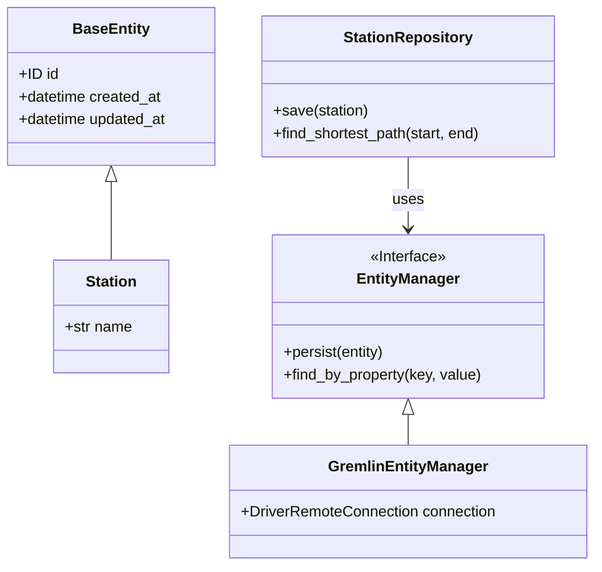

# soltania-python-persistence-api

[](https://www.python.org/)
[](https://github.com/astral-sh/uv)
[](LICENSE)

🗄️ **Python Persistence API**: A JPA (Java Persistence API) and Spring Data inspired abstraction layer.

This framework unifies database access (SQL & NoSQL) via a robust implementation of the **Repository Pattern** and the **Entity Manager**. The current implementation focuses on **Apache TinkerPop (Gremlin)** for Graph Databases.

---

## 📑 Table of Contents
- [Architecture & Concepts](#-architecture--concepts)
- [Installation](#-installation)
- [Configuration Guide](#-configuration-guide)
- [Usage](#-usage)
- [Running the Demos (Paris Metro)](#-running-the-demos)
- [Tests](#-tests)
- [Project Structure](#-project-structure)

---

## 🏗 Architecture & Concepts

This project ports solid concepts from the Java ecosystem to Python:

1.  **Domain Entities (`@Entity`)**: Uses **Pydantic** to define strongly typed data models with runtime validation.
2.  **Entity Manager (`EntityManager`)**: An agnostic interface managing the object lifecycle (persist, find, remove) and the underlying driver connection.
3.  **Repositories (`Repository`)**: A business abstraction layer hiding query complexity (Gremlin, SQL) behind simple methods (`save`, `find_by_id`, `find_shortest_path`).

### Simplified Class Diagram



---

## 🚀 Installation

This project uses **[uv](https://github.com/astral-sh/uv)** for lightning-fast dependency management.

1.  **Clone the repository:**
    ```bash
    git clone [https://github.com/your-user/soltania-python-persistence-api.git](https://github.com/your-user/soltania-python-persistence-api.git)
    cd soltania-python-persistence-api
    ```

2.  **Install dependencies and environment:**
    ```bash
    uv sync
    ```
    *This command automatically creates the `.venv` folder and installs everything needed.*

---

## ⚙️ Configuration Guide

This project uses a hierarchical configuration system inspired by Spring Boot. You do not need to modify the code to switch environments (Dev, Test, Prod).

Variables are defined and centralized in `src/soltania_persistence/config.py`.

### 📋 Available Variables

| Variable | Description | Default Value |
| :--- | :--- | :--- |
| `GREMLIN_HOST` | IP Address of the Tinkerpop/Gremlin server | `localhost` |
| `GREMLIN_PORT` | Server Port | `8182` |
| `GREMLIN_PROTOCOL` | `ws` (WebSocket) or `wss` (Secure) | `ws` |
| `SOLTANIA_CONFIG_PATH` | Path to an external config file | *None* |

### 🚀 Source Priority (Hierarchy)

The active value is determined by this priority order (from highest to lowest):

1.  **Command Line Arguments** (CLI)
2.  **Environment Variables** (OS)
3.  **External Configuration File** (via `SOLTANIA_CONFIG_PATH`)
4.  **Internal `.env` File** (Project root)
5.  **Default Values** (Code)

### 🛠️ Configuration Methods (Examples)

**1. Via CLI Arguments (Highest Priority)**
Ideal for overriding a value temporarily during a test.
Use the `--variable_name=value` format.

```bash
uv run src/soltania_persistence/app/run_path.py --gremlin_host=192.168.1.50
```

**2. Via Environment Variables**
Ideal for CI/CD (Docker, Kubernetes).

```bash
# Linux / Mac
export GREMLIN_HOST=10.0.0.1
uv run src/soltania_persistence/app/main.py

# Windows (PowerShell)
$env:GREMLIN_HOST="10.0.0.1"
uv run src/soltania_persistence/app/main.py
```

**3. Via Local `.env` File (Dev)**
Create a `.env` file at the root:
```properties
GREMLIN_HOST=192.168.6.40
GREMLIN_PORT=8182
```

---

## 💻 Usage

### 1. Define an Entity
Inherit from `BaseEntity`. Pydantic handles validation.

```python
from typing import ClassVar
from soltania_persistence.core.domain import BaseEntity

class User(BaseEntity):
    # Mapping to Vertex Label (Graph) or Table (SQL)
    __label__: ClassVar[str] = "user" 
    
    username: str
    email: str
```

### 2. Use a Repository
Never manipulate the database directly. Use the repository.

```python
from soltania_persistence.provider.tinkerpop.manager import GremlinEntityManager
from soltania_persistence.config import settings

# Initialization
em = GremlinEntityManager(settings.gremlin_url)
repo = UserRepository(em)

# Save (Create or Update)
user = User(username="admin", email="admin@corp.com")
saved_user = repo.save(user)

print(f"User saved with ID: {saved_user.id}")
```

---

## 🚇 Running the Demos

The project includes a demo application modeling the **Paris Metro** (Lines 1 and 9).

### 1. Populate the Database (Migration)
This script creates the stations (Vertices) and connections (Edges) in your Gremlin server.

```bash
uv run src/soltania_persistence/app/main.py
```

### 2. Calculate an Itinerary
This script uses the shortest path algorithm via the Repository.

**Default Usage (La Défense -> Château de Vincennes):**
```bash
uv run src/soltania_persistence/app/run_path.py
```

**Custom Usage:**
```bash
uv run src/soltania_persistence/app/run_path.py "Bastille" "République"
```
*Output Example:*
```text
✅ ITINERARY FOUND:
📍 START: Bastille
    ⬇️  (Take Line 1)
🚉 Gare de Lyon
    ⬇️  (Take Line 14)
🏁 ARRIVAL: Bercy
```

---

## 🧪 Tests

Tests are managed by `pytest` and divided into two categories.

### Unit Tests
Test the logic of models and repositories using **Mocks** (no DB connection required).
```bash
uv run pytest -m "not integration"
```

### Integration Tests
Actually connect to the configured Gremlin server to validate read/write operations.
```bash
uv run pytest tests/integration
```

### Run All (with coverage)
```bash
uv run pytest
```

---

## 📂 Project Structure

```text
soltania-python-persistence-api/
├── pyproject.toml           # Dependency management (Maven/Gradle equivalent)
├── uv.lock                  # Exact version locking
├── .env                     # Local environment variables (Ignored by Git)
├── src/
│   └── soltania_persistence/
│       ├── config.py        # ⚙️ Hierarchical configuration engine
│       ├── core/            # 🧱 The Framework (Interfaces, Domain)
│       │   ├── domain.py    # BaseEntity, Relationship
│       │   └── interfaces.py # EntityManager, Repository (Abstract)
│       ├── provider/        # 🔌 Implementations (Drivers)
│       │   └── tinkerpop/   # Gremlin Driver (Graph DB)
│       └── app/             # 🚇 Demo Application (Metro)
│           ├── models.py    # Station, Connection
│           ├── repositories.py # StationRepository
│           ├── main.py      # Population script
│           └── run_path.py  # Pathfinding script
└── tests/                   # 🧪 Unit and Integration Tests
```

---

## 📸 Real-world Example

Here is an actual execution trace when requesting a path between **Esplanade de la Défense** and **République**.

Notice how the algorithm correctly identifies the optimal transfer from **Line 1** to **Line 9** at *Franklin D. Roosevelt*.

```console
$ uv run src/soltania_persistence/app/run_path.py "Esplanade de la Défense" "République"

Configuration loaded: ws://192.168.6.40:8182/gremlin
Request: Path from 'Esplanade de la Défense' to 'République'
  [Repo] Searching path with lines: Esplanade de la Défense -> République

✅ ITINERARY FOUND (17 stops):
========================================
📍 START: Esplanade de la Défense
    ⬇️  (Take Line 1)
🚉 Pont de Neuilly
    ⬇️  (Take Line 1)
🚉 Les Sablons
    ⬇️  (Take Line 1)
🚉 Porte Maillot
    ⬇️  (Take Line 1)
🚉 Argentine
    ⬇️  (Take Line 1)
🚉 Charles de Gaulle - Étoile
    ⬇️  (Take Line 1)
🚉 George V
    ⬇️  (Take Line 1)
🚉 Franklin D. Roosevelt
    ⬇️  (Take Line 9)
🚉 Saint-Philippe du Roule
    ⬇️  (Take Line 9)
🚉 Miromesnil
    ⬇️  (Take Line 9)
🚉 Saint-Augustin
    ⬇️  (Take Line 9)
🚉 Havre - Caumartin
    ⬇️  (Take Line 9)
🚉 Chaussée d'Antin - La Fayette
    ⬇️  (Take Line 9)
🚉 Richelieu - Drouot
    ⬇️  (Take Line 9)
🚉 Grands Boulevards
    ⬇️  (Take Line 9)
🚉 Bonne Nouvelle
    ⬇️  (Take Line 9)
🚉 Strasbourg - Saint-Denis
    ⬇️  (Take Line 9)
🚉 République
========================================
🏁 ARRIVAL