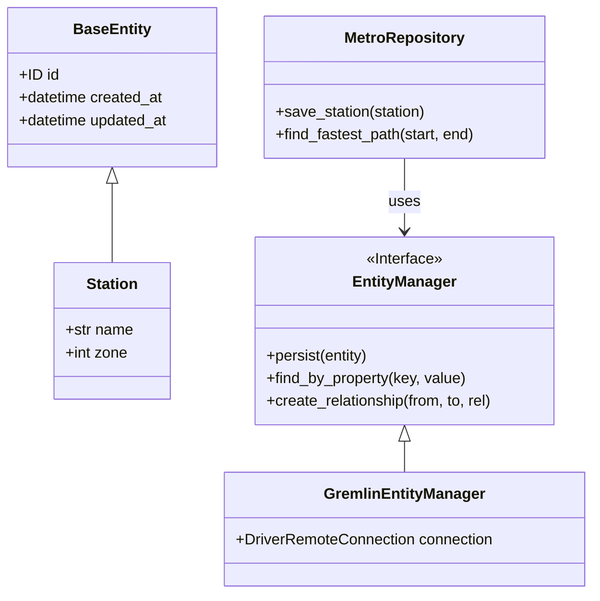

# soltania-python-persistence-api

[](https://www.python.org/)
[](https://github.com/astral-sh/uv)
[](LICENSE)

🗄️ **Python Persistence API**: A JPA (Java Persistence API) and Spring Data inspired abstraction layer.

This framework unifies database access (SQL & NoSQL) via a robust implementation of the **Repository Pattern** and the **Entity Manager**. The current implementation focuses on **Apache TinkerPop (Gremlin)** for Graph Databases.

---

## 📑 Table of Contents
- [Architecture & Concepts](#-architecture--concepts)
- [Installation](#-installation)
- [Configuration Guide](#-configuration-guide)
- [Usage](#-usage)
- [Running the Demos (Paris Metro)](#-running-the-demos)
- [Project Structure](#-project-structure)
- [Tests](#-tests)

---

## 🏗 Architecture & Concepts

This project ports solid concepts from the Java ecosystem to Python:

1.  **Domain Entities (`@Entity`)**: Uses **Pydantic** to define strongly typed data models with runtime validation.
2.  **Entity Manager (`EntityManager`)**: An agnostic interface managing the object lifecycle (persist, find, remove) and the underlying driver connection.
3.  **Repositories (`Repository`)**: A business abstraction layer hiding query complexity (Gremlin, SQL) behind simple methods (`save`, `find_by_id`, `find_fastest_path`).

### Simplified Class Diagram



---

##🚀 InstallationThis project uses **[uv](https://github.com/astral-sh/uv)** for lightning-fast dependency management.

1. **Clone the repository:**
```bash
git clone [https://github.com/your-user/soltania-python-persistence-api.git](https://github.com/your-user/soltania-python-persistence-api.git)
cd soltania-python-persistence-api

```


2. **Install dependencies and environment:**
```bash
uv sync

```


*This command automatically creates the `.venv` folder and installs everything needed.*

---

##⚙️ Configuration GuideThis project uses a hierarchical configuration system inspired by Spring Boot. Variables are defined in `src/soltania_persistence/config.py`.

###📋 Available Variables| Variable | Description | Default Value |
| --- | --- | --- |
| `GREMLIN_HOST` | IP Address of the Tinkerpop/Gremlin server | `localhost` |
| `GREMLIN_PORT` | Server Port | `8182` |
| `GREMLIN_PROTOCOL` | `ws` (WebSocket) or `wss` (Secure) | `ws` |

###🚀 Source Priority1. **CLI Arguments** (e.g. `--gremlin_host=10.0.0.1`)
2. **Environment Variables** (`export GREMLIN_HOST=...`)
3. **Internal `.env` File** (Project root)
4. **Default Values** (Code)

---

##🚇 Running the Demos (Paris Metro)The project includes a complete example modeling the **Paris Metro Network** located in `src/soltania_persistence/examples/metro_network`.

###1. Initialize the DatabaseYou must first clean and populate the database with the provided line data (JSON).

```bash
# Clear database (Drop)
uv run src/soltania_persistence/examples/metro_network/main.py drop

# Import data (Load)
uv run src/soltania_persistence/examples/metro_network/main.py load

```

###2. Calculate an ItineraryRun the pathfinding algorithm between any two stations.

**Example 1: A simple trip**

```bash
uv run src/soltania_persistence/examples/metro_network/main.py "Mairie des Lilas" "Châtelet"

```

**Example 2: A complex trip (with transfer)**

```bash
uv run src/soltania_persistence/examples/metro_network/main.py "Mairie des Lilas" "Chelles - Gournay"

```

###📸 Real-world OutputHere is an actual execution trace. Notice how the engine intelligently detects transfers:

```text
🚀 FASTEST ROUTE (43 min 30 sec)
==================================================
📍 START : Mairie des Lilas

   ⬇️  TAKE 🚇 METRO 11
      ▪️ Porte des Lilas
      ▪️ Télégraphe
      ▪️ Place des Fêtes
      ▪️ Jourdain
      ▪️ Pyrénées
      ▪️ Belleville
      ▪️ Goncourt
      ▪️ République
      ▪️ Arts et Métiers
      ▪️ Rambuteau
      ▪️ Hôtel de Ville
      ▪️ Châtelet

   🔄 TRANSFER : Take 🚄 RER A
      ▪️ Gare de Lyon
      ▪️ Nation
      ▪️ Vincennes
      ▪️ Val de Fontenay
      ▪️ Neuilly-Plaisance
      ▪️ Bry-sur-Marne
      ▪️ Noisy-le-Grand - Mont d'Est
      ▪️ Noisy - Champs

   🔄 TRANSFER : Take 🚇 METRO 16
      ▪️ Chelles - Gournay
==================================================
🏁 ARRIVAL : Chelles - Gournay

```

---

##📂 Project StructureThe project follows a modular "Domain-Driven" structure.

```text
soltania-python-persistence-api/
├── pyproject.toml               # Dependencies
├── .env                         # Local config
├── src/
│   └── soltania_persistence/
│       ├── config.py            # ⚙️ Configuration Engine
│       ├── core/                # 🧱 Framework Core (Entities, Interfaces)
│       ├── provider/            # 🔌 Drivers (Tinkerpop/Gremlin)
│       └── examples/
│           └── metro_network/   # 🚇 Domain Example: Transport
│               ├── data/        # JSON Data (lines.json)
│               ├── models/      # Nodes (Station) & Edges (Connection)
│               ├── repositories/# Gremlin Logic (Pathfinding)
│               ├── services/    # ETL/Importer Logic
│               └── main.py      # Entry Point (CLI)
└── tests/                       # 🧪 Unit & Integration Tests

```

---

##💻 Usage (Code Snippet)Here is how you would use the framework in your own code:

```python
from soltania_persistence.provider.tinkerpop.manager import GremlinEntityManager
from soltania_persistence.config import settings
from my_app.repositories import UserRepository

# 1. Initialize Manager
em = GremlinEntityManager(settings.gremlin_url)
repo = UserRepository(em)

# 2. Persist Data
user = User(username="admin", email="admin@corp.com")
repo.save(user)

# 3. Query Data
found_user = repo.find_by_username("admin")

```

---

##🧪 Tests```bash
# Run unit tests
uv run pytest -m "not integration"

# Run all tests (requires running Gremlin server)
uv run pytest